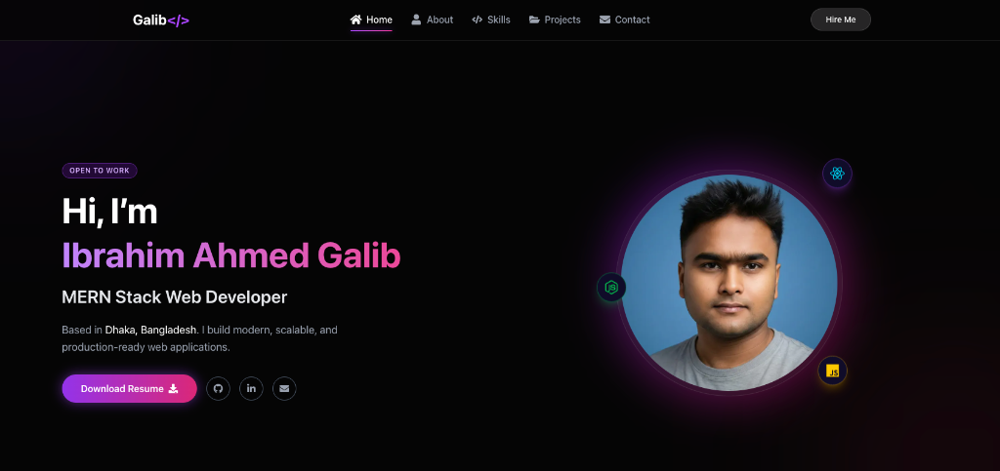

# 🚀 Premium MERN Developer Portfolio

A high-performance, cinematic personal portfolio website built with **Next.js (App Router)**, **Tailwind CSS**, and **Framer Motion**. It features premium animations, a glassmorphism design system, and a fully functional contact form powered by EmailJS.

**🔗 Live Demo:** [https://protfolio-hi9pqt0dl-ibrahim-ahmed-galibs-projects.vercel.app](https://protfolio-five-omega.vercel.app)



## ✨ Key Features

- **🎬 Cinematic Experience**: Professional loading screen with deterministic progress and smooth exit animations.
- **⚡ High Performance**: Built on Next.js 14 App Router for optimal SEO and speed.
- **🎨 Premium Animations**: 
  - Complex stagger, fade, and spring animations using **Framer Motion**.
  - Interactive hover effects and "glowing" UI elements.
  - Page transition effects.
- **📱 Fully Responsive**: Optimized for all devices with a mobile-first approach.
- **📧 Functional Contact Form**: 
  - Real-time form validation.
  - Direct email delivery to inbox using **EmailJS**.
  - Secure environment variable configuration.
- **🧩 Component Architecture**: Modular, reusable components (Project Cards, Modals, Skill Bars).

## 🛠️ Tech Stack

- **Framework**: [Next.js 14](https://nextjs.org/)
- **Styling**: [Tailwind CSS](https://tailwindcss.com/)
- **Animations**: [Framer Motion](https://www.framer.com/motion/)
- **Icons**: [React Icons](https://react-icons.github.io/react-icons/)
- **Email Service**: [EmailJS](https://www.emailjs.com/)
- **Deployment**: [Vercel](https://vercel.com/)

## 🚀 Getting Started

### 1. Clone the Repository

```bash
git clone https://github.com/galibhub/portfolio-nextjs.git
cd portfolio-nextjs
```

### 2. Install Dependencies

```bash
npm install
```

### 3. Environment Configuration

Create a `.env.local` file in the root directory and add your EmailJS credentials:

```env
NEXT_PUBLIC_EMAILJS_SERVICE_ID=your_service_id
NEXT_PUBLIC_EMAILJS_TEMPLATE_ID=your_template_id
NEXT_PUBLIC_EMAILJS_PUBLIC_KEY=your_public_key
```

### 4. Run Development Server

```bash
npm run dev
```

Open [http://localhost:3000](http://localhost:3000) to see the site live.

## 📂 Project Structure

```
├── src/
│   ├── app/                # App Router pages (layout.js, page.js)
│   ├── components/         # Reusable UI components
│   │   ├── Navbar.jsx
│   │   ├── HeroSection.jsx
│   │   ├── AboutSection.jsx
│   │   ├── SkillsSection.jsx
│   │   ├── ProjectsSection.jsx
│   │   ├── ContactSection.jsx
│   │   ├── Loader.jsx      # First-load animation
│   │   └── ...
│   └── utils/              # Helper functions & animation variants
│       └── animations.js
├── public/                 # Static assets (images, icons)
├── .env.local              # Local environment variables
└── README.md               # Project documentation
```

## 🌍 Deployment

This project is optimized for deployment on **Vercel**.

1. Push your code to GitHub.
2. Import the project into Vercel.
3. Add the **Environment Variables** in Vercel's project settings (same keys as `.env.local`).
4. Click **Deploy**.

## 📝 License

This project is open-source and available under the [MIT License](LICENSE).

---

Developed with ❤️ by **Ibrahim Ahmed Galib**
